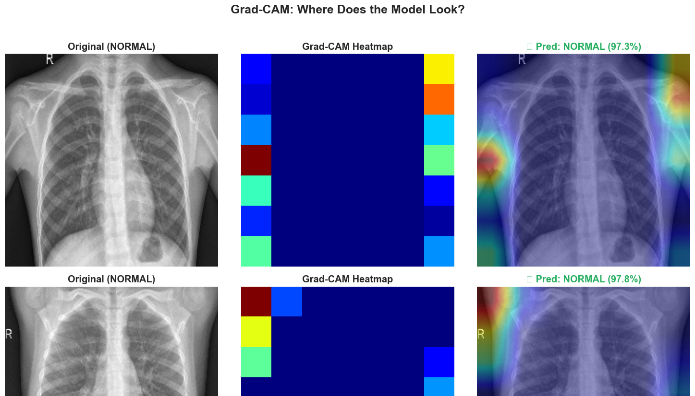
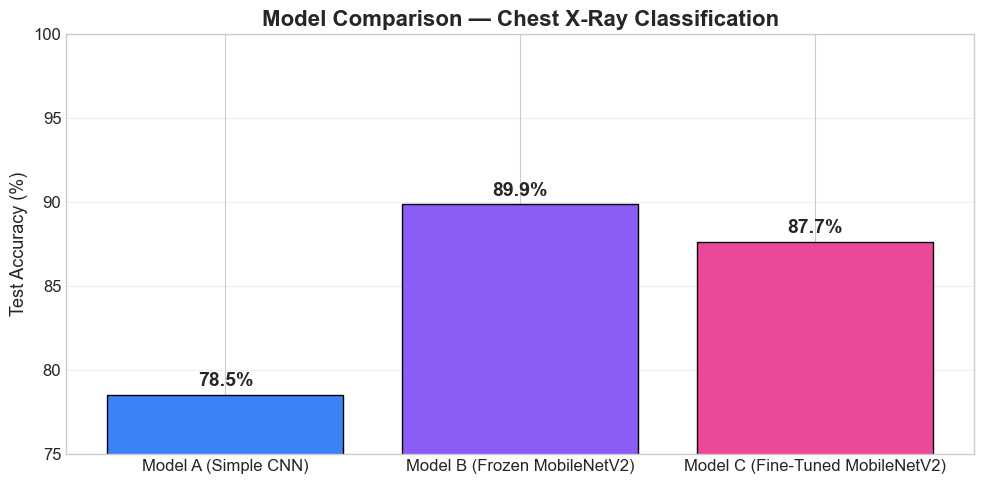

# Pneumonia Detection from Chest X-Rays

A deep learning project that classifies chest radiographs as Normal or Pneumonia using three CNN approaches, with Grad-CAM heatmaps to verify the model focuses on the correct anatomical regions.

<p align="center">
  
  
</p>


## Problem

Pneumonia is a leading cause of death worldwide, and early detection from chest X-rays is critical. This project explores whether transfer learning from natural images (ImageNet) can effectively detect pneumonia in grayscale medical images, and whether we can prove the model is making decisions based on the right visual evidence.

## Dataset

The dataset comes from Kermany et al. and is available on Kaggle ("Chest X-Ray Images (Pneumonia)"). It contains 5,863 chest X-ray images split into training (~5,216 images), validation (16 images), and test (624 images) sets. The classes are heavily imbalanced with approximately 3× more Pneumonia than Normal images, which was addressed using computed class weights (Normal=1.94×, Pneumonia=0.67×). All images were resized to 224×224 pixels and augmented conservatively (±10° rotation, ±5% shifts, horizontal flip, ±10% zoom/brightness) to preserve anatomical realism.

## Approaches

Three architectures were compared to measure the impact of transfer learning and fine-tuning.

**Model A (Simple CNN)** is a 3-block VGG-style CNN trained entirely from scratch. Each block contains two Conv2D layers with BatchNormalization, followed by MaxPooling and Dropout. The head uses GlobalAveragePooling, a 256-unit Dense layer, and a sigmoid output. Trained with Adam at LR=3e-4.

**Model B (Frozen MobileNetV2)** uses MobileNetV2 pre-trained on ImageNet (1.4M natural images, 1000 classes) with all 154 base layers frozen. Only a custom classification head (GlobalAveragePooling → Dense 256 → Dropout 0.5 → Sigmoid) is trained, with Adam at LR=1e-4.

**Model C (Fine-Tuned MobileNetV2)** starts from Model B's trained weights, unfreezes the last 20 layers of MobileNetV2, and continues training at 10× smaller learning rate (1e-5) to adapt pre-trained features to X-ray specifics.

## Results

| Model                        | Test Accuracy | Notes                                                                 |
| ---------------------------- | ------------- | --------------------------------------------------------------------- |
| A. Simple CNN (from scratch) | 78.5%         | Unstable training, insufficient data for learning from zero           |
| **B. Frozen MobileNetV2**    | **89.9%**     | Best performer, stable convergence, ImageNet features transfer well   |
| C. Fine-Tuned MobileNetV2    | 87.7%         | Overfit despite 98.4% val accuracy, dataset too small for fine-tuning |

**Medical Metrics (Model C):** Sensitivity 96.7% (catches nearly all pneumonia), Specificity 72.6%, 13 missed pneumonia cases out of 390, 64 false alarms out of 234 healthy patients.

**Threshold Tuning:** Adjusting the classification threshold from 0.50 to 0.60 achieves 95.9% sensitivity with 76.5% specificity, an optimised balance for screening where missing pneumonia is far more costly than a false alarm.

**Confidence Calibration:** The model's average confidence on correct predictions (95.1%) is significantly higher than on incorrect predictions (79.3%), meaning uncertain cases can be flagged for human radiologist review.

## Grad-CAM Explainability

Grad-CAM (Gradient-weighted Class Activation Mapping) generates heatmaps showing which image regions the model focuses on. For pneumonia cases, the model highlights cloudy/opaque lung regions consistent with infection patterns. For normal cases, attention is distributed across clear lung fields. This is critical for medical AI trustworthiness and is a regulatory requirement (FDA) for clinical deployment.

A technical challenge was solved in implementing Grad-CAM: MobileNetV2 was wrapped as a nested model inside the outer Functional model, making the Conv_1 layer inaccessible from the outer computation graph. The fix involved building a dual-output model from the base model's internals and manually passing through the head layers inside the GradientTape to maintain a single connected graph for gradient computation.

## Key Findings

Transfer learning from ImageNet to medical X-rays works remarkably well. The frozen MobileNetV2 (89.9%) outperformed the from-scratch CNN (78.5%) by 11.4 percentage points, demonstrating that low-level visual features (edges, textures, gradients) learned from natural images are universal enough to benefit grayscale medical imaging.

Fine-tuning did not improve results on this dataset (87.7% vs 89.9%). With only ~5,200 training images and a 16-image validation set, unfreezing layers led to overfitting. The model achieved 98.4% validation accuracy during training but couldn't generalise to the test set. This is a valid finding: fine-tuning typically requires larger datasets (10K+) to outperform frozen transfer learning.

For medical screening, sensitivity (recall for pneumonia) is more important than overall accuracy. A missed pneumonia case is far more dangerous than a false alarm, and the model's 96.7% sensitivity with threshold tuning makes it a useful screening tool when combined with radiologist confirmation.

## Limitations

The original validation set contains only 16 images, making validation metrics extremely noisy and EarlyStopping unreliable. A proper validation split (10-15% of training data) would stabilise training and likely improve all models. The dataset is from a single institution, so external validation on other hospitals' X-rays would be needed before any clinical consideration. The model also performs binary classification only and does not distinguish between bacterial and viral pneumonia.


## Setup

```bash
pip install -r requirements.txt
```

Download the dataset from [Kaggle](https://www.kaggle.com/datasets/paultimothymooney/chest-xray-pneumonia), unzip to a `data/` folder, and update `BASE_DIR` in the notebook. Running on Google Colab with a T4 GPU is recommended.

## Technologies

TensorFlow/Keras, MobileNetV2, Grad-CAM, OpenCV, scikit-learn, Matplotlib, Seaborn
